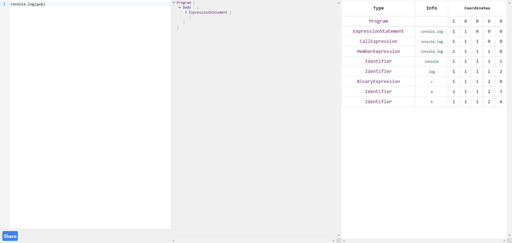

# Abstract Syntax Tree

Abstract Syntax Tree - is the web application that visualize your JavaScript code as the Abstract Syntax Tree(AST) and its Parallel Data Representation(PDR).

## Description

The application helps interested people delve into the parallel compilation (where PDR is involved).
We suggested the one-page web application that builds required representations of JavaScript code.
It has three blocks: code editor, AST, and Parallel Array Representation. The blocks will synchronize,
and with the mutations of the code, the other representations will change too.

## How to use it

To use this web application just go to the following [link](https://innoswp.github.io/AbstractSyntaxTree/) and paste your JavaScript code.

## List of features

### Already have:

- Immediate result when typing code without pressing any buttons
- Synchronous highlighting part of code and corresponding nodes in AST and lines in PDR
- Error message for user when code is not valid
- Possibility to share your code with corresponding AST and PDR via link by pressing button "Share"
- Other features coming soon...

## Demonstration

<p>Starting page:</p>


## Technologies used

The application was build using [Svelte](https://svelte.dev/) framework. As a code editor we used [CodeMirror](https://codemirror.net/).
To parse the source code we used [Esprima API](https://esprima.org/).

## Project installation for modifications

Before project installation be sure that you have installed [npm tools](https://www.npmjs.com/) and [Svelte](https://svelte.dev/) framework

1. Clone the repository
```console
git clone https://github.com/InnoSWP/AbstractSyntaxTree
```

2. Go to the root of the project
```console
cd <PATH>/AbstractSyntaxTree
```

3. Run
```console
npm install
```

4. Now you can do any changes and modification in project.

5. To run this project on your computer use following command
```console
npm run dev
```
